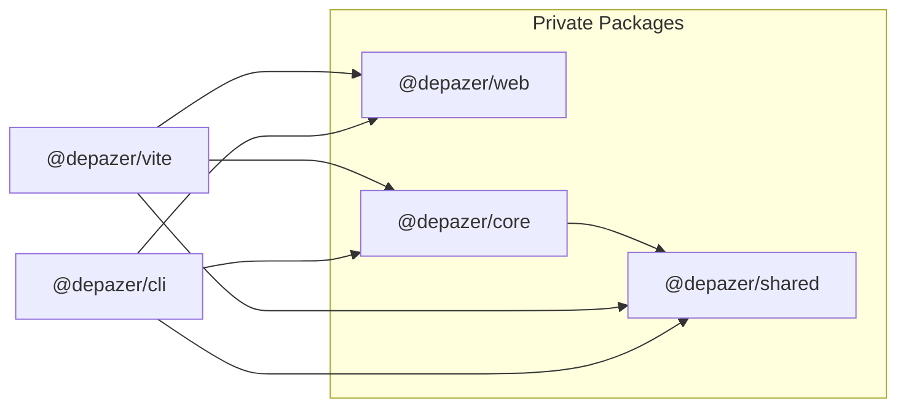

# Depazer Contributing Guide

Hi! I'm really excited that you are interested in contributing to depazer. Before submitting your contribution, please make sure to take a moment and read through the following guidelines

## Development Setup

You will need [Node.js](https://nodejs.org) **version 16+**, and [PNPM](https://pnpm.io) **version 8+**.

After cloning the repo, run:

```bash
$ pnpm i # install the dependencies of the project
```

A high level overview of tools used:

- [TypeScript](https://www.typescriptlang.org/) as the development language
- [Vite](https://vitejs.dev/) and [ESBuild](https://esbuild.github.io/) for development bundling
- [Vitest](https://vitest.dev/) for unit testing
- [Tsx](https://github.com/esbuild-kit/tsx) for run TypeScript
- [Vue 3](https://v3.vuejs.org/) for frontend framework
- [Unocss](https://unocss.dev/) for frontend styling
- [Prettier](https://prettier.io/) for code formatting
- [ESLint](https://eslint.org/) for static error prevention (outside of types)

## Extensions

We recommend using [VSCode](https://code.visualstudio.com/) with the following extensions:

- [vue.volar]() for vue 3
- [vue.vscode-typescript-vue-plugin]() for vue 3
- [editorconfig.editorconfig]() for editorconfig
- [dbaeumer.vscode-eslint]() for eslint
- [esbenp.prettier-vscode]() for prettier
- [lokalise.i18n-ally]() for i18n preview in vscode
- [antfu.iconify]() for iconify preview in vscode
- [antfu.unocss]() for unocss preview in vscode

## Git Hooks

The project uses [husky](https://typicode.github.io/husky/) to enforce the following on each commit:

- Check unit tests before push
- Automatically format changed files using Prettier & Eslint
- Verify commit message format (conventional commit)

## Scripts

- [`pnpm build`](#pnpm-build)
- [`pnpm dev:cli`](#pnpm-dev:cli)
- [`pnpm dev:web`](#pnpm-dev:web)
- [`pnpm cz`](#pnpm-cz)
- [`pnpm preview`](#pnpm-preview)
- [`pnpm lint`](#pnpm-lint)
- [`pnpm test`](#pnpm-test)

### pnpm build

The `build` script builds all packages in the repository. It is equivalent to running `pnpm build` in each package directory.

### pnpm dev:cli

The `dev:cli` script runs the `cli` package without bundle. It is equivalent to running `pnpm dev` in the `cli` package directory.

You can run `nr dev:cli --help` to see cli the help message.

```bash
$ pnpm dev:cli --help
$ pnpm dev:cli analyze
```

### pnpm dev:web

The `dev:web` script runs the `web` package without bundle. It is equivalent to running `pnpm dev` in the `web` package directory.

### pnpm cz

The `cz` script runs the commitizen cli.

### pnpm preview

The `preview` script runs the `cli` package with bundle.

### pnpm lint

The `lint` script runs the `eslint` cli.

### pnpm test

The `test` script simply calls the `vitest` binary, so all [Vitest CLI Options](https://vitest.dev/guide/cli.html#options) can be used. Some examples:

```bash
# run once and exit
$ pnpm test

# run all tests in watch mode
$ pnpm vitest

# run once and exit with coverage
$ pnpm test:cov

# run all tests in watch mode with coverage
$ pnpm vitest --coverage
```

## Project Structure

This repository employs a [monorepo](https://en.wikipedia.org/wiki/Monorepo) setup which hosts a number of associated packages under the `packages` directory:

### Public packages:

- `cli`: The depazer CLI.

- `vite`: The depazer plugin for Vite.

---

### Private packages:

- `core`: The depazer core functions for search local node_modules.

- `shared`: Some common functions such as logger & file IO.

- `web`: Depazer frontend.

### Importing Packages

The packages can import each other directly using their package names. Note that when importing a package, the name listed in its `package.json` should be used. Most of the time the `@depazer/` prefix is needed:

```js
import { successLogger } from '@depazer/shared'
```

`package.json`

```json
devDependencies: {
  "@depazer/shared": "workspace:*"
}
```

### Package Dependencies


