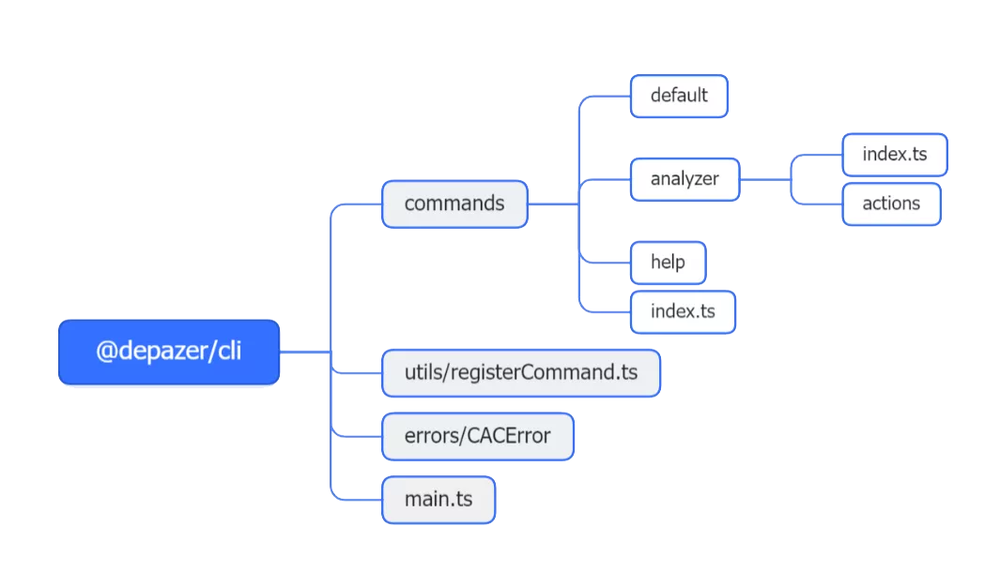

# @depazer/cli



cli项目基于`cac`构建，`cac`是一个轻量级的命令行解析器，支持子命令，选项，参数等。

## 目录结构

- `src` 业务源码目录
- `build` 项目打包

### cli命令目录

- `src/commands`目录存放cli命令脚本
- `src/commands/index.ts`文件导出cli所有需要注册的命令
- `src/commands/xxx`目录为cli各个命令的实现

### utils目录

- `src/utils`目录存放cli命令相关的工具函数
- `src/utils/registerCommand.ts`文件用于注册cli命令

## 添加新的cli命令

例子：添加一个`analyze`命令

### 1. 新建`src/commands/analyze`目录(目录名尽量与命令名一致)

### 2. 新建`src/commands/analyze/index.ts`文件

```ts
// src/commands/analyze/index.ts
import type { CreateCommand } from '@/types/command'

interface AnalyzeOption extends Record<string, unknown> {
  '--': unknown[]
}

export const createAnalyzeCommand: CreateCommand<AnalyzeOption> = function () {
  return {
    // 命令执行函数
    action(args: AnalyzeOption) {
      console.log('analyze')
    },
    // 命令别名
    alias: 'a',
    // 命令名
    command: 'analyze',
    // 命令描述
    description: 'Analyze package dependencies'
  }
}
```

### 3. 在`src/commands/index.ts`文件中导出`analyze`命令构造函数

导出的命令构造函数会在`cli`启动时被调用，注册命令，具体实现在`src/utils/registerCommand.ts`中

主要做了命令的注册和命令help信息的美化

```ts
// src/commands/index.ts
export { helpCallback } from './help'
import { createAnalyzeCommand } from './analyze'
import { createDefaultCommand } from './default/index'

export const createCommandFunctions = [createAnalyzeCommand, createDefaultCommand]
```

### 4.测试命令

```bash
# 在/packages/cli目录下执行
pnpm dev analyze

# 或在根目录下执行
pnpm --filter cli dev a
```

### 5.添加命令选项

`-p, --port <number>`

```bash
# 报错: 必须指定端口号
pnpm dev a -p

# 正确
pnpm dev a -p 4936
```

`-p, --port [number]`

```bash
# 正确 action接受的参数值 p 或 port 为 true
pnpm dev a -p

# 正确 action接受的参数值为 p 或 port 为 4936
pnpm dev a -p 4936
```

命令中配置选项

```ts
// src/commands/analyze/index.ts
import type { CreateCommand } from '@/types/command'

interface AnalyzeOption extends Record<string, unknown> {
  p: number
  port: number
  '--': unknown[]
}

export const createAnalyzeCommand: CreateCommand<AnalyzeOption> = function () {
  return {
    action({ port }: AnalyzeOption) {
      console.log('analyze', port)
    },
    alias: 'a',
    command: 'analyze',
    description: 'Analyze package dependencies',
    options: [
      {
        // 选项名 -p 或 --port option的缩写仅支持单个字符
        rawName: '-p, --port <number>',
        description: 'Port of analyzer server',
        config: {
          // 默认值 有没有 -p 或 --port 都会有默认值 4936
          default: 4936
        }
      }
    ]
  }
}
```

### 6. 工程化

若命令的action函数过复杂时，可以考虑将action函数抽离到单独的文件中，如下：

新建文件`src/commands/analyze/types.ts`，将公共类型抽离到该文件中(如`AnalyzeOption`)

```ts
interface AnalyzeOption extends Record<string, unknown> {
  port: number
  p: number
  '--': unknown[]
}

export type { AnalyzeOption }
```

新建文件夹`src/commands/analyze/actions`存储action相关函数
新建文件`src/commands/analyze/actions/index.ts` 用于执行不同的action函数(类似路由)

```ts
// src/commands/analyze/actions/index.ts
import { CACError } from '@/errors/CACError'
// action函数
import { generateReport } from './generateReport'
// action函数
import { startAnalyzer } from './startAnalyzer'

import type { AnalyzeOption } from '../types'

export default function ({ jsonFile, port, '--': args }: AnalyzeOption) {
  if (args.length !== 0) {
    // CACError 会被捕获并打印错误信息 tag 为 `COMMAND ERROR`
    // 例子： COMMAND ERROR  Unknown option `-t`
    throw new CACError('Unknown option ' + JSON.stringify(args))
  }

  // 根据不同的参数执行不同的action函数
  switch (true) {
    case !!jsonFile:
      /**
       * @example pnpm dev a -j  |  depazer analyze --jsonFile
       * @example pnpm dev a -j report.json  |  depazer a --jsonFile report.json
       */
      return generateReport(typeof jsonFile === 'boolean' ? 'analyzer.json' : jsonFile)
    default:
      /**
       * @example pnpm dev a  |  pnpm dev analyzer
       * @example depazer a  |  depazer analyzer
       */
      return startAnalyzer(port)
  }
}
```

命令入口文件`src/commands/analyze/index.ts`修改为如下：

```ts
// src/commands/analyze/index.ts
import action from './actions'

import type { AnalyzeOption } from './types'
import type { CreateCommand } from '@/types/command'

export const createAnalyzeCommand: CreateCommand<AnalyzeOption> = function () {
  return {
    action,
    alias: 'a',
    command: 'analyze',
    description: 'Analyze package dependencies',
    options: [
      {
        rawName: '-p, --port <number>',
        description: 'Port of analyzer server',
        config: {
          default: 4936
        }
      }
    ]
  }
}
```
