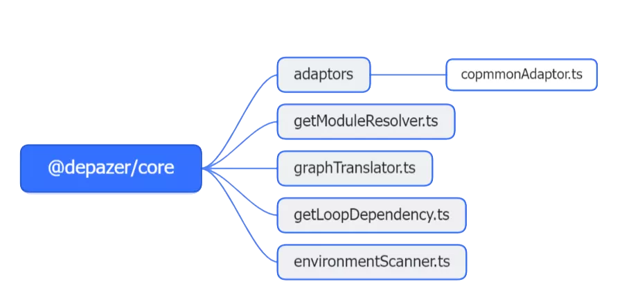

# @depazer/core

该包提供了依赖分析的核心函数

- `environmentScanner.ts`用于获取当前目录使用的包管理器，是否已经安装了依赖，有无`package.json`等信息。
- `commonAdaptor.ts`(支持`npm`, `yarn`, `pnpm`, `bun`)用于生成node_modules的模块依赖树(并不完整，会省略已查找过的依赖)。
- `getModuleResolver.ts`用于根据环境信息初始化解析器所需参数并选择解析器(目前只有commonAdaptor)。
- `graphTranslator.ts`用于将依赖树打平，并添加是否是开发依赖，依赖查询深度等信息，方便进一步处理。
- `getLoopDependency.ts`用于查询循环依赖，并将其依赖链以字符串数组输出
