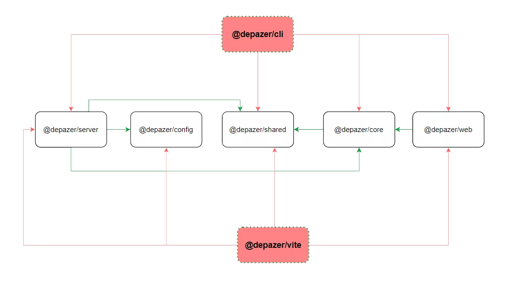

# Depazer 开发指南

## 项目仓库

本项目基于 [Pnpm Workspase](https://pnpm.io/zh/workspaces) 实现了 Monorepo 架构，通过**单仓库多项目**的方式管理代码。

仓库 【packages】 目录下共有 `cli` , `core` , `server` , `shared` , `vite` , `web` , `config` 7个子项目，另有 【docs】 目录用于构建文档站点。

```sh
.
├─ docs/    # 文档目录
└─ packages/  # 项目目录
   ├─ cli
   ├─ config
   ├─ core
   ├─ server
   ├─ shared
   ├─ vite
   └─ web
```

其中 [@depazer/cli](https://www.npmjs.com/package/@depazer/cli) 与 [@depazer/vite](https://www.npmjs.com/package/@depazer/vite) 已作为依赖包发布到了 npm 平台。


