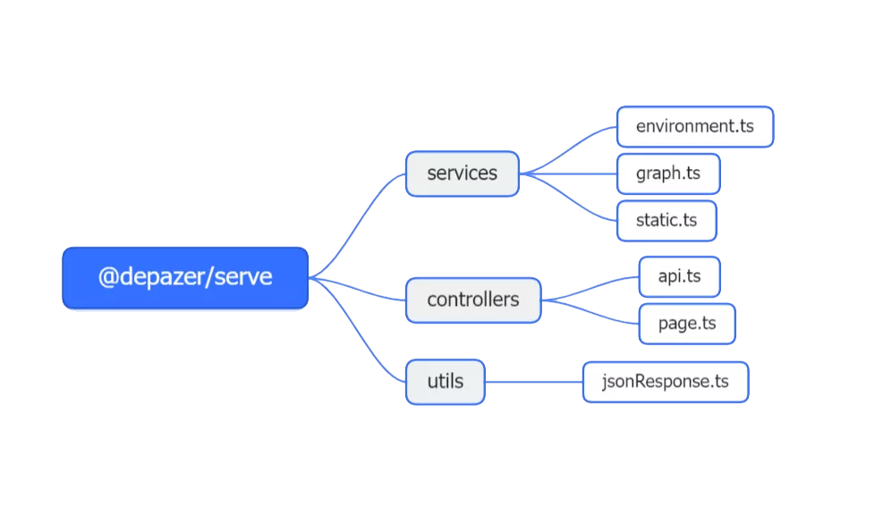

# @depazer/server

该包提供了服务器端的服务，用于提供静态资源服务和 `api` 服务

- `environment.ts` 用于提供环境信息服务，包管理器，`node.js` 版本等
- `graph.ts` 用于提供依赖有向图节点的相关服务
- `static.ts` 实现静态服务
- `apiController` 用于根据api路径来选择不同的服务
- `pageController` 用于根据请求路径返回静态资源
- `jsonResponse.ts` 用于返回服务器响应
